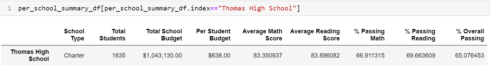
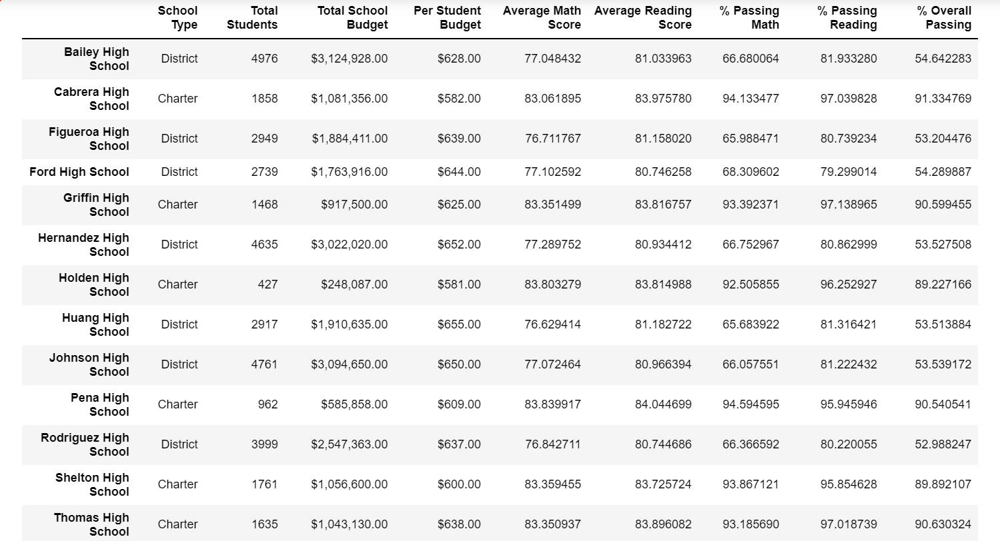

# School_District_Analysis
Using Ananconda 3, python 3.7.9 
<<<<<<< HEAD
in this Analysis we are replacing the math and reading scores for Thomas High School with NaNs while keeping the rest of the data intact. we have also done a school district analysis to see  how these changes affected the overall analysis.
=======
## Overview
 
 This Analysis was to generate a district-wide summary. 
 The school board has notified  evidence of academic dishonesty; specifically, reading and math grades for Thomas High School ninth graders appear to have been altered. Although the school board does not know the full extent of the academic dishonesty, they want to uphold state-testing standards and have turned  for help. Here, attempt has been made  to replace the math and reading scores for Thomas High School with NaNs while keeping the rest of the data intact. Once replaced the math and reading scores, a school district analysis done  to see  how these changes affected the overall analysis.
 We are replacing the math and reading scores for Thomas High School with NaNs while keeping the rest of the data intact. 
>>>>>>> c08be2007d08f5bf33324d6be479feb22273328f
## District Summary affect
There was only **0.1-0.2 %** difference in the overall pass percentage.There is no a much of a significant difference  when compared to district summary with altered 9th grade scores from Thomas high school
## School Summary effect
### This below table is a school summary for Thomas high school, how the math and reading grade were affected  for 9th grade and the differences in the scores
 ####                               ** Before replacing 9th grade score                  After Replacing 9th grade score **

**Avg math score                    83.41                                                   83.36
Avg reading score                   83.84                                                   83.89
% passing reading                   97.20                                                   69.66
% passing math                      93.27                                                   66.91
Overall percentage                  90.94                                                   65.07 **

## Scores by school spending after Replacing 9th grade scores for Thomas high school Spending range
Due to just .01- .02 % difference in the spending , there is no overall change of scores by school spending before and after replacing 9th grade scores. They remain the same.
<<<<<<< HEAD

## Scores by school size
There is no overall change of scores by school size, before and after replacing 9th grade scores. They remain the same.

## Scores by school Type
There is no overall change of scores by school type, before and after replacing 9th grade scores. They remain the same.

=======
## Scores by school size
There is no overall change of scores by school size, before and after replacing 9th grade scores. They remain the same.
## Scores by school Type
There is no overall change of scores by school type, before and after replacing 9th grade scores. They remain the same.

# Below Images show Scores for Math, Reading and overall pass Percentage before replacing the math, reading and overall passpercentage of Thomas High School after adding it. 

## BEFORE

## AFTER

>>>>>>> c08be2007d08f5bf33324d6be479feb22273328f
## After Reading and math scores have been Changed for 9th grade for Thomas high school
- There is no significant difference in the School District summary
- There are minor differences in average math and reading scores for school summary as show in the School Summary Effect above in _line 10 and 11_
- There is approximately 30% difference in the Pass Percentage for reading , math and overall percentage 
- There is no difference in any score when categorised by school spending, school size and school type.

<<<<<<< HEAD
=======

>>>>>>> c08be2007d08f5bf33324d6be479feb22273328f
